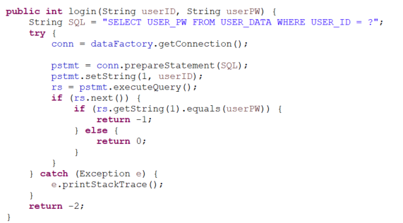

# “인스턴트 이력서 생성기”

### 정해진 양식을 입력하면 HTML 또는 Markdown 형식의 이력서를 생성해주는 서비스입니다.
### [시연 영상🎬](https://youtu.be/zetGHOhnEs8)

---

 - ✅ **사용자 맞춤형 이력서 생성**
     
     사용자의 정보를 입력하면 원하는 양식에 맞춰 이력서를 자동 생성해주는 웹서비스로,
     입사 지원자들의 이력서 작성 과정을 **간소화**할 수 있습니다.
     
 
 - ✅ **포트폴리오 양식 제안과 작성 지원**
     
     기술 포트폴리오 양식의 결정 및 작성에 따른 어려움을 해결하기 위해 
     다양한 템플릿과 콘텐츠 작성 **가이드라인**을 제공합니다.
     
 
 - ✅ **다운로드 기능 제공**
     
     생성된 이력서와 포트폴리오를 다양한 파일 형식으로 다운로드할 수 있어서,
     사용자가 다른 플랫폼과 환경에서도 손쉽게 **활용**할 수 있습니다.
---

 

# 프로젝트 기획 의도 / 추진 배경

### 프로젝트 추진 계획 및 근거

- **주제 선정 키워드**
    
    초보자로 이루어진 팀 + 첫 개발 팀프로젝트 + 짧은 기간이라는 조건을 감안해,
    
    - 구현 가능한 범위 안에서 최대한 **완성도** 있게 만들 수 있는 주제인가?
    - 실제로 사용 가능하면서도 **시각적**으로 결과물을 바로 보여줄 수 있는 주제인가?
    - 세미 프로젝트의 **목적**과 주요 기술 목표, 기획 방향에 부합하는 주제인가?

- **기획 배경**
    - 자기소개서 웹페이지 작성 과제가 주어진 적이 있었는데,
    수강생들은 대부분 백엔드 지망이기 때문에 웹페이지 작성에 어려움을 겪었습니다.
    페이지에 포함해야 할 내용 결정에도 고민이 많았습니다.
    - 그래서 “이력서를 자동으로 생성해 주는 서비스” 의 필요성을 떠올렸습니다.
    - 발상을 발전시켜 “본인의 정보를 입력해서 맞춤형 이력서를 만들 수 있는 서비스” 라는 주제를 선정했습니다.

- **기획 차별성**
    - 이미 기존에 사람인, 잡코리아 등의 취업 사이트에서 이력서 작성 서비스를 제공하고 있고, 캔바 등 예쁜 이력서 양식만 제공하는 서비스도 있습니다.
    - 하지만 그러한 서비스에서는 타겟이 넓기 때문에 필요한 부분만 취사선택하기 복잡합니다.
    - 그래서 “개발자에게 특화된 양식” 을 제공하고, “다운로드 기능” 을 제공해 본인의 프로젝트에 적용할 수 있다는 부분에서 차별성을 보여주기로 했습니다.

 

### 기능 구현 서비스

> **회원 가입, 로그인, 마이페이지 :** 
정보를 서블릿으로 전달해 DB 데이터를 검증하고, JSP를 사용해 화면으로 정보를 보여준다.

- **HTML Type 이력서 작성 서비스 :** 
form에 정보를 입력해 제출하면, 디자인된 HTML 페이지에 정보를 담아 제공한다. HTML 다운로드 기능을 제공하므로 다른 곳에 응용할 수 있다. 

- **Markdown Type 이력서 작성 서비스 :** 
form에 정보를 입력해 제출하면, 해당 정보로 작성된 Markdown 텍스트를 제공한다. 텍스트를 복사해 GitHub Readme.md나 다른 곳에 붙여넣을 수 있다. 
Markdown 미리보기 기능도 제공하며, 여기에는 Marked.js 및 GitHub Markdown css 프로젝트를 적용했다.
 

 

## Tech Stack

- **Frontend**
    - JSP, JavaScript
 
- **Backend**
    - JAVA

 
 

# 서비스 소개

### 타겟

- 웹페이지 작성에 어려움을 겪는 초보 개발자

### 기술 구현한 내용 및 근거 자료

- 프론트엔드
    - 로그인
    - 회원가입
    - 마이페이지
    - HTML 이력서 폼/결과물
    - Markdown 이력서 폼/결과물
    - About, Team 페이지
- 백엔드
    - 로그인
        

   
- 회원가입
        

        
 - 세션 정보로 로그인 여부 체크
        

 
 

### 기대효과

- 프론트에 익숙하지 않은 개발자라도 디자인된 이력서를 쉽게 생성할 수 있으므로,
웹페이지 제작에 들일 시간을 절약해줄 수 있다.
- HTML 코드를 제공하므로 필요 시 수정하거나 일부를 발췌해 개인 웹사이트 또는 블로그 등에 적용할 수 있는 확장성이 있다.

 

### 향후 개선 사항

- 소셜 로그인
- 생성한 이력서 저장
- 입력 정보 종류 늘리기

 
 

# SR(Software Requirement) 설계

## Wire Frame

.png)

 

## Design

.png)

.png)

.png)

.png)

.png)

.png)     

 

## Flow Chart

 

## DB Schema

